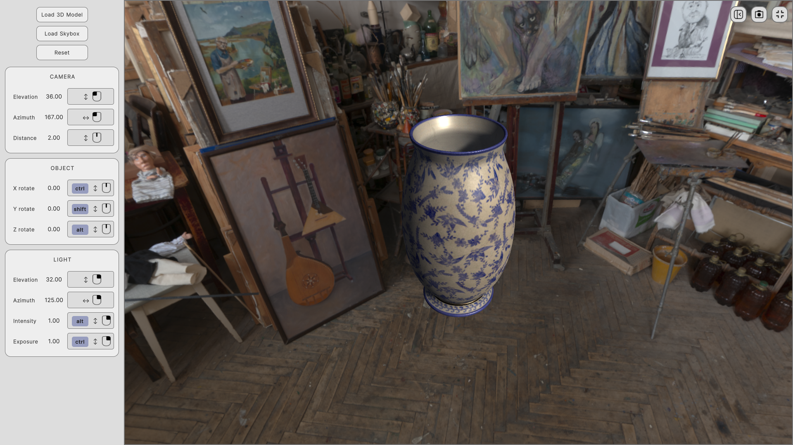

# AssetBundle Viewer (ABV)
This is a very simple Unity application which can be used in editor as is, or built into a standalone for viewing assetbundle files. This was originally created as a utility application for a neuroscience research project but it can be used during game development to quickly check the quality of assetbundles. View oribitting, zooming, directional light intensity and direction, background exposure, and snapshotting are the available controlled parameters.
 
 

# Running 
For running in Unity Editor, just open *ABVScene* and run it inside editor. Alternatively, you can build a player with *ABVScene* included.

In case you decided to build a standalone player, in order to make it behave more like an ordinary windowed application (resizing, minimizing, window snapping, entering and exiting fullscreen), please make sure to make these changes in the *player settings*:

1. In *Resolution* section under *Resolution and Presentation*, select *Windowed* from the *Fullscreen Mode* dropdown.

2. In *Standalone Player Options* under *Resolution and Presentation*, check *Resizeable Window* and "Allow Fullscreen Switch" checkboxes.
 
 

# License
AssetBundle Viewer (ABV) is licensed under Apache 2.0 License.
 
 

# Credits
+ Developed by Farzad Shayanfar
+ [Gökhan Gökçe](https://github.com/gkngkc) for his work on [UnityStandaloneFileBrowser](https://github.com/gkngkc/UnityStandaloneFileBrowser)